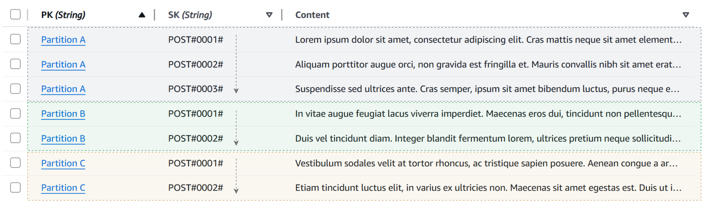
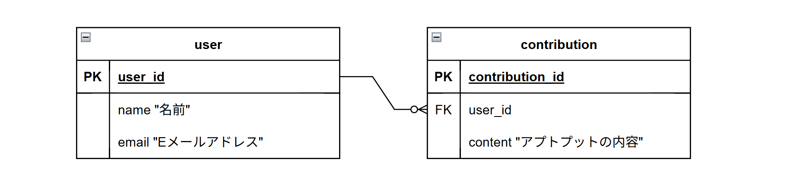
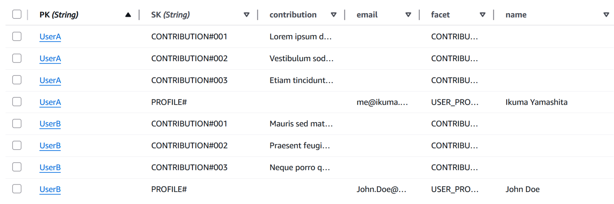
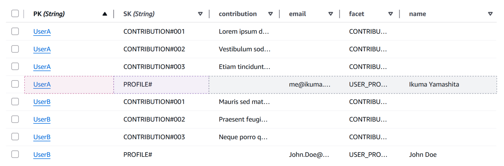
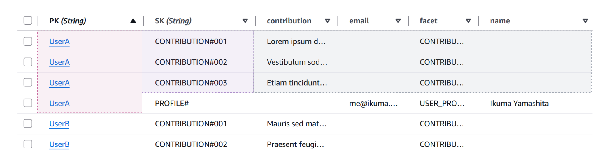
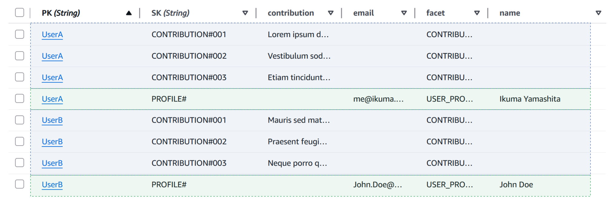

# Amazon DynamoDB の設計は　具体的にはどうするのだろう？

Ikuma Yamashita

  <button @click="$slidev.nav.openInEditor()" title="Open in Editor" class="slidev-icon-btn">
    <carbon:edit />
  </button>
  <a href="https://github.com/46ki75/lt-aws-dynamodb-arch" target="_blank" class="slidev-icon-btn">
    <carbon:logo-github />
  </a>

<!--
皆様、こんばんは。

山下 生真と申します。本日は、「Amazon DynamoDB の設計は　具体的にはどうするのだろう？」というテーマでお話させていただきます。

お集りの Jr.Champions の方々であれば、DynamoDB がどのようなサービスかはご存知かと思いますが、実際にどうやって設計するのかというところは、かなり踏み込まないと理解しにくい部分かと思います。

今回は 5分という短い時間ですが、勘所を押さえて次の学習に役立てるような内容にしたいと考えております！

どうぞよろしくお願いします！
-->

---

<Profile />

<!--
まず私の自己紹介です。

パブリッククラウドサービス上でインフラエンジニアをしております。主に POSIX 系のサーバー構築を Ansible で行うことが多いです。

仕事ではインフラエンジニアですが、学生時代は組み込みをやっていて現在は OSS 開発などを行っています。
-->

---

# Amazon DynamoDB の特徴

Amazon DynamoDB は**サーバーレス**の**フルマネージド** **NoSQL** データベースです。

## 主な特徴

- **サーバーレス**: インフラ管理が不要で、使った分だけの従量課金
- **フルマネージド**: パッチ適用、バックアップ、スケーリングが自動化
- **高パフォーマンス**: 一桁ミリ秒の低レイテンシを実現

## RDBMSとの違い

- **水平スケーリング**: データ量やアクセス数の増加に強い
- **結合操作なし**: テーブル間のJOINは基本的に行わない設計思想

<!--
まず、DynamoDb の特徴についてです。

多くの方がご存知の部分が多いと思いますので、「主な特徴」の部分については省略させてください。

今回は RDBMS との違いの部分に着目してお話します。ここに記したもの以外にも多くありますが、特に有効なものをピックアップしました。特にアーキテクトとして案件に入る場合、ここの違いやメリデメを説明できる必要がありますね。

「RDBMS との違い」 の部分にご注目ください。

「**水平スケーリング**」 についてですが、これは RDBMS では達成が難しいものです。一応 RDBMS でも、複数 DB に分けて二層コミットを実装することで水平スケーリングはできますが、調停サーバーのスケーリングを考えると、真の水平スケーリングと言えるかは微妙です。特にペタバイトオーダーになると調停サーバーのスケーリングも考える必要が出てきますね。

続いて「**結合操作なし**」についてですが、これは DynamoDB がデータが増えてもレイテンシがほとんど変わらない理由の一つです。RDBMS だと正規化したデータの結合時にデータが増えるごとに互いのインデックスが増えるため、大規模になると非機能要件を満たさなくなってしまうことが出てきてしまいますね。
-->

---

# 主キーの選択

Amazon DynamoDB では2種類の主キーを選択できます

- **PK(パーティションキー)のみ**: KV ストアとして使用する場合
- **PK(パーティションキー)とSK(ソートキー)の複合**: ドキュメント DB として使用する場合

今回ご紹介する設計パターンは PK と SK の複合主キーの場合についてです。

<!--
続いて、DynamoDB のテーブルを作成する際に必ず設定が必要になる主キーの選択についてご説明します。

DynamoDB のテーブル作成時には、単一の主キーと複合主キーを選択することができます。今回ご紹介するのは パーティションキー と ソートキー の組み合わせによって一意となる場合についての設計パターンです。

PK と SK の複合によって主キーが構成される場合、図のようなデータ配置となります。図の点線で囲まれている特定のパーティション内でソートキーの順番でデータが並んでいます。
-->

---

# CU (Capacity Unit) について

**Capacity Unit** とは、Amazon DynamoDB の**データベース操作の計算コスト**を指します。これは**レイテンシ**及び**金銭的コスト**に直結します。

つまり、**消費する Capacity Unit を最小限に抑える**ように設計を行うことが一つの重要な目標です。

- RCU (Read Capacity Unit): 読み取り操作に使用する CU
- WCU (Write Capacity Unit): 書き込み(挿入・変更・削除)操作に使用する CU

## スループットモードの違い

Amazon DynamoDB の Capacity Unit には[2つのスループットモード](https://docs.aws.amazon.com/ja_jp/amazondynamodb/latest/developerguide/capacity-mode.html)があり、課金体系が違います。

- オンデマンド: Capacity Unit の上限を指定せず、使用された Capacity Unit の分だけ課金される。[^1]
- プロビジョンド: Capacity Unit の上限を設定し、設定値に基づいて時間課金される。

[^1]: サービスクォータによって実質的な制限あり

<!--
お次に Capacity Unit についてご説明します。

Capacity Unit は DynamoDB を利用する上で非常に重要な概念です。Capacity Unit は端的に言うと、データベース操作にかかった計算コストを指しています。

これはレイテンシや金銭的コストに直結します。つまり、消費する Capacity Unit を最小限に抑えるように設計を行うことが一つの重要な目的です。これ以降でも Capacity Unit の消費を抑えることに着目して話を進めていきます。

また、Capacity Unit は書き込みと読み込みのそれぞれを区別します。それぞれ Read Capacity Unit, Write Capacity Unit として分かれています。

スループットモードについては上限を指定するかしないかで2つのモードがあります。これによって料金体系と API のレートリミットが決まるというわけです。
-->

---

# API の種類

書き込み API はどのようなテーブル設計でも殆ど消費 CU が変わりませんが、読み取り API はどのようなテーブル設計にするかで消費 CU が大きく変わります。

このため、まずは **読み取り API** がそれぞれどのような役割を持つかを理解するところから始まります。

|        |                                                                                                                     |
| ------ | ------------------------------------------------------------------------------------------------------------------- |
| Create | <ApiChip>PutItem</ApiChip> <ApiChip>BatchWriteItem</ApiChip>                                                        |
| Read   | <ApiChip i>GetItem</ApiChip> <ApiChip i>BatchGetItem</ApiChip> <ApiChip i>Query</ApiChip> <ApiChip i>Scan</ApiChip> |
| Update | <ApiChip>UpdateItem</ApiChip> <ApiChip>PutItem</ApiChip>                                                            |
| Delete | <ApiChip>DeleteItem</ApiChip> <ApiChip>BatchWriteItem</ApiChip>                                                     |

※ [PartiQL](https://docs.aws.amazon.com/ja_jp/amazondynamodb/latest/developerguide/ql-reference.html) という SQL 互換のクエリ言語による API も存在するが、訛りがきつめ。

<!--
続いて、DynamoDB で利用できる API についてご紹介します。

副作用がある API はテーブルの設計によって消費する Capacity Unit はほぼ変わりません。そのため、この中で重要なものは読み取り系の API です。

表にある 青背景 の API が重要な APIですね。
-->

---

# 読み取り API の種類

## `GetItem`, `BatchGetItem`

- `GetItem`: 主キー ("PK" もしくは "PK と SK の組み合わせ") によってアイテムを1件取得するAPI
- `BatchGetItem`: `GetItem` をまとめて複数回実行できる API (通信ラウンドトリップが減る)

## `Query`

特定の PK 内の項目について、SK を用いて欲しいデータを絞り込んで取得する

SK はソートされているため、以上・以下……などのソートされている前提の条件が使用可能

## `Scan`

テーブルのすべてのデータを取得する。大量に CU を使用するため本番ワークロードでは非推奨。

<!--
データの読み取り API についてご説明します。

最初に GetItem についてですが、これは主キーによって1つのデータを取得するものです。`BatchGetItem` は `GetItem` の複数レコードに対しての操作を1回の API 呼び出しでできるというものです。

次に `Query` ですが、こちらは特定のパーティション内でソートされているアイテムに対して特定範囲のデータを絞り込んで取得することができる操作です。`Query` は少し複雑なので後の実例で補足します。

最期に `Scan` ですが、これはテーブルのフルスキャンであり、Capacity Unit を大量に消費するので使用しません。

まとめると、`GetItem`, `BatchGetItem`, `Query` の 3種類の API のみでデータ取得ができるようにテーブル設計をする必要があるということです。
-->

---

# 例から設計方法を理解する

Japan AWS Jr.Champions のアウトプット内容を管理するための DB 設計を行いたい

## RDBMS の場合……

これを Amazon DynamoDB で設計する場合について考えます

<!--
では、実際に DynamoDB でどのような設計をするのかについてご説明したいのですが、まずは非常に一般的な RDB の DB 設計を DynamoDB でどのように表現するかを考えてみます。

例として、Jr. Champions のアウトプットを管理するための DB を考えます。

RDB だと、`user` テーブルと `contribution` テーブルを作成して、ユーザーに複数のアウトプットを関連付けるために `user_id` を結合用のキーとしますよね。これが DynamoDB だとどうなるでしょうか？
-->

---

Amazon DynamoDB でテーブル設計を行う場合、**読み取り操作** が重要 (再確認)

今回の例で必要な読み取り操作は、以下の2つです。

- 特定の **ユーザー** の読み取り
- **アウトプット** の読み取り → 特定 **ユーザー** の **アプトプット** の一覧の読み取り

<!--
まず、DynamoDB では読み取り操作が重要でした。

このため、必要な読み取り操作を洗い出します。

今回は非常にシンプルで、

- 特定のユーザーの読み取りと
- ユーザーごとのアウトプット一覧の読み取り、つまりあるユーザーがどんなアウトプットをしているか調べることができるようにするということです。

実際にこの2つのパターンはどのように読み取るのかをお見せします。
-->

---

## ユーザーの読み取り

**PK** + **SK** の組み合わせでデータを一意に特定できるため、`GetItem` でデータを取得します。

- PK: `UserA`
- SK: `PROFILE#`

<!--
まず、ユーザーの読み取りは `GetItem` で行います。

単一ユーザーの読み取りなので、一意性のあるデータを取得できる `GetItem` でよいということですね。

今回 PK の値として格納した `UserA` は ユーザーを識別する ID としてほかのユーザーと被ることはないという制約があります。

`UserA` という値のみでそのユーザーを特定できますが、`UserA` というパーティションに様々なデータを格納できるため、`UserA` という値でそのユーザーであるとわかっても アイテムまでは特定できないわけです。そのため、今回は SK に `PROFILE#` を設定しました。
-->

---

## アウトプットの読み取り

`Query` の `begins_with` (~で始まる) 条件を使用することで取得できます。

- PK: `UserA`
- SK: `SK begins_with CONTRIBUTION#`

※ わかりやすいように ID に該当する部分をシリアル値にしていますが、実際には UUID の方が安全です

(結果的整合性が担保される分散 DB であるため書き込み時に調停サーバーが必要になる)

<!--
アウトプットの読み取りに関しては、`Query` を使用します。

`Query` は特定パーティションを指定して、そのパーティション内でソートされているカラムに対して使用できます。

`begins_with` は特定のキーワードで始まるデータを取得できる条件です。

一見、ソートと無縁に思えますが、文字列もソートされているため、表の CONTRIBUTION#` が並んでいて範囲として成立していることがビジュアル的にもわかります。

この `begins_with` という条件が非常に強力で、これを活かすために `#` でデータモデル名と ID を分けて順番にデータが並ぶように設計するのです。

これによって、RDB のようなテーブル間の結合操作という、データの増加に伴い重くなる操作なしに 1対多 のデータを高速で取得できるのです。
-->

---

# 1つのテーブルに全てのデータモデルを詰め込む

- RDB: データモデルごとにテーブルを分ける
- Amazon DynamoDB: _1つのテーブルに全てのデータモデルを格納する_
  - → このパターンを **Single Table Design** と呼ぶ

<!--
全く触れていませんでしたが、先ほど提示したデータ取得パターンでは、本来 RDBMS では複数テーブルに分けるはずのデータモデルを1つのテーブルに詰め込んでいました。

この 1つのテーブルに全てのデータモデルを格納するパターンを Single Table Design と言い、DynamoDB を使用する上で推奨されるパターンです。

表の色分けされている部分が RDBMS ではテーブルが分かれているはずのデータモデルです。
-->

---

# まとめ

## 設計の基本原則

- **アクセスパターン優先**: 先にクエリパターンを洗い出す！
  - NoSQL は設計完了後に自由にクエリできるカラムを増やすことが困難
  - 書き込みはどのように設計してもほとんどパフォーマンスは変わらない

- **コスト最適化**: 消費する Capacity Unit を減らす！
  - 読み取りに `Scan` は使わない
  - `Query` を使用して結合操作を削減する

<!--
最期に、今回お伝えしたかったことのまとめです。

DynamoDB の設計ではアクセスパターンを重視します。今回ご紹介する際にもどのようなスキーマにするかとはお伝えせず、どのようなデータ取得をしたいかという例からお伝えしました。これは実際に DynamoDB での設計に近い考え方となっていました。

次に、コスト最適化です。消費する Capacity Unit を減らすことを考えてください。これを考えれば、コストだけでなくレイテンシも安定します。このためにテーブルの全スキャンである `Scan` は使用しないことを覚えておいてください。

以上で発表は終了です。

DynamoDB は永年無料枠がありますので、今回ご興味を持たれた方はぜひ触ってみてください。

ご清聴ありがとうございました。
-->
